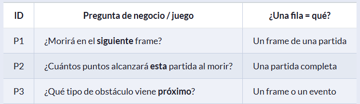
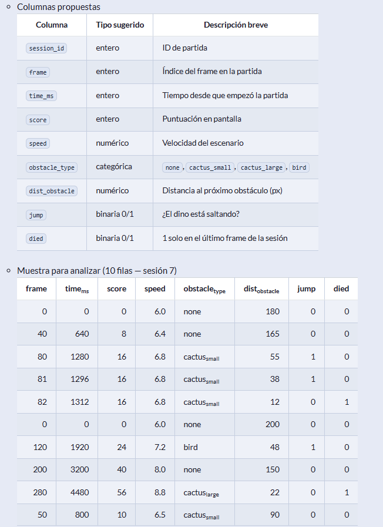
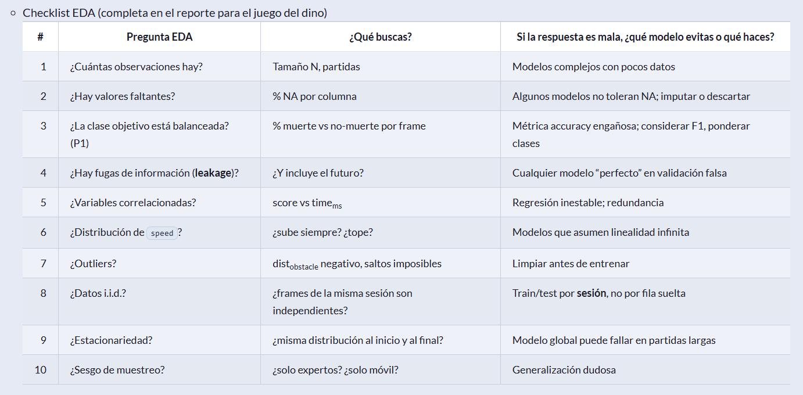
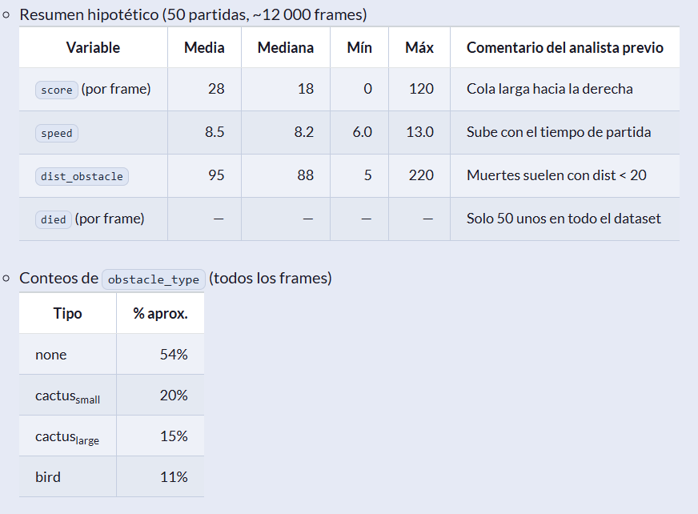
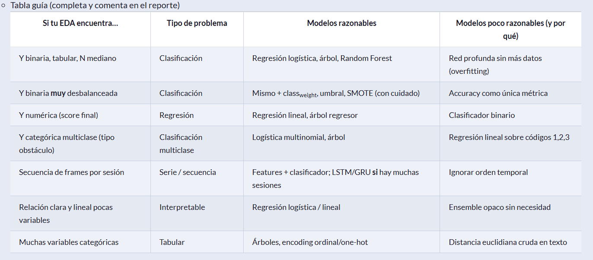
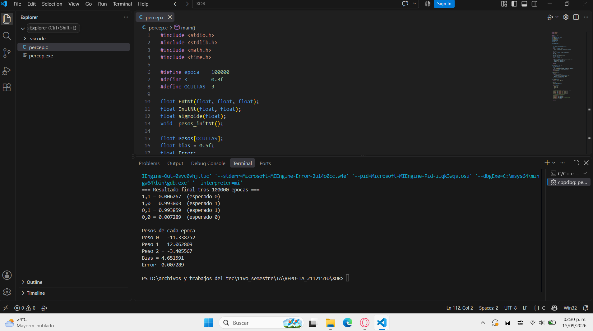

# REPO-IA_21121510 <br>
 
 **Autor: Diego Ignacio Correa Cervantes**  <br></br>


### Ejercicio 01-09-2026 Avance en clase <br> 
 <br>

### Ejercicio 01-09-2026 Terminado <br> 
 <br> <br>

### Evaluacion A* avance <br> 
 <br>

### Evaluacion A* terminado <br> 
 <br> <br>

<br>

## Actividad Dino Crash EDA conceptual <br>

**Analista:** [Diego Ignacio Correa Cervantes / 21121510]

### Bloque 1 — ¿Qué dataset necesitamos? <br>

#### Misión 1: Definir el problema y el dataset ideal <br>

*Escenarios posibles* <br>

 <br></br>

*P1*

+ Variable objetivo (Y): Nombre de la columna *morirá?*, tipo binaria ya que es una respuesta de si o no.
+ Variables de entrada (X): esta vivo?, Numero de frame, velocidad del dinosaurio, tiempo, distancia desde el obstaculo anterior, distancia hasta el siguiente obstaculo, ¿esta saltando?, ¿esta agachado?, tipo del obstaculo anterior, tipos de obstaculos.
+ Granularidad: Necesita revisarse cada vez que el dinosaurio avance un frame dentro de la partida para evaluar si morira en el siguiente, al final  de la partida se obtendra la informacion del ultimo frame evaluado.
+ Tamaño mínimo razonable: Suficientes partidas para abarcar todos los casos en los que el dinosaurio puede morir al avanzar al siguiente frame.
+ Riesgo si el dataset está mal definido: no abarcar datos sufuientes para distinguir cuando es que el dinosaurio puede morir, no podra evaluarse correctamente cuando puede morir el dinosaurio y por lo tanto no se aprendera como evitarlo. <br>

*P2*

+ Variable objetivo (Y): Nombre de la columna *puntaje*, tipo numérica/entero pues es un valor que crece conforme mas tiempo dure una partida.
+ Variables de entrada (X): Numero de frame, tiempo, velocidad del dinosaurio, numero de obstaculos superados, distancia en frames recorrida. 
+ Granularidad: Se requiere de un registro que actualice los datos con cada frame recorrido y arroje un resumen al final de la partida.
+ Tamaño mínimo razonable: Una partida completa pues se trata de la puntuacion al final de la partida en curso.
+ Riesgo si el dataset está mal definido: No establecer una forma o formula de como calcular el puntaje, no sera posible calcular el puntaje al final de la partida lo que hara mas dificil distinguir las diferencias de cada una para aprender cual es un resultado deseable. <br>

*P3*

+ Variable objetivo (Y): Nombre de la columna *Tipo del siguiente obstaculo*, tipo categórica pues existen varios tipos de obstaculos. 
+ Variables de entrada (X): numero de frame, velocidad del dinosaurio, tiempo, distancia desde el obstaculo anterior, distancia hasta el siguiente obstaculo, tipo del obstaculo anterior, tipos de obstaculos. 
+ Granularidad: se requiere revisar cada vez que se avance un frame durante la partida para poder evaluar si viene un obstaculo y de que tipo es.   
+ Tamaño mínimo razonable: las partidas necesarias para empezar a predecir que tan seguido pueden aparecer y de que tipo son los obstaculos.   
+ Riesgo si el dataset está mal definido: La informacion sobre los obstaculos no esta bien diferenciada, se produciran datos erroneos que volveran imposible crear predicciones utiles <br></br> 

#### Misión 2: Diccionario de datos (qué debe traer el CSV) <br>

*Borrador para P1* <br>

 <br></br> 

*Preguntas:* <br>

1. ¿Qué patrón ves en la fila donde died=1 (frame 82)? <br>
   El dinosaurio a avanzado y frente a el se encuentra un cactus pequeño que no logro saltar por lo cual la partida termino. <br>

2. ¿=score= es buena variable para predecir muerte en el siguiente frame? ¿Por qué sí o no? <br>
   No es tan exacta como la variable tiempo_ms pero ambas pueden servir para saber que tanto a durado la partida y mientras mas dure es mas probable que no sea posible sortear algun obstaculo. <br>

3. ¿Falta alguna columna crítica para P1? (pista: altura del dino, agachado, lag de reacción del jugador…) <br>
   ancho del dinosaurio, largo del dinosaurio, esta agachado?, tiempo de reaccion del jugador, distancia desde el obstaculo anterior. 

4. ¿=died= tal como está definida sirve para P1 o solo describe el final de la partida? <br>
   Describe el final de la partida lo que ayuda a diferenciar cada una, sin embargo tambien genera un desbalance pues siempre habra muchos menos registros de muerte. <br></br>

### Bloque 2 —  Preguntas que todo EDA debe responder <br>

#### Misión 3: Las diez preguntas del analista <br></br> 

 <br></br> 

*Preguntas:* <br>

1. Elige tres preguntas del checklist y respóndelas como si tuvieras el dataset completo del dino (hipótesis razonables). <br>
   + Pregunta 3 --> ¿La clase objetivo está balanceada? (P1)<br>
     La mayoría de los frames son de "no-muerte" lo que significa que el dinosaurio vive en muchos frames antes de chocar y cambiar de estado por lo que el dataset esta fuertemente desbalanceado. <br>

   + Pregunta 6 — ¿Distribución de *speed*? <br>
     En el juego real, la velocidad aumenta progresivamente con el score pero se estabiliza en un máximo. Por lo tanto lo ideal es utilizar las variables de time_ms y score como guia para alcanzar una distribucion creciente pero no lineal e infinita. <br>
  
   + Pregunta 8 — ¿Datos i.i.d.? <br>
     Los frames consecutivos de una partida están altamente correlacionados por ejemplo el score de un frame depende del anterior,
     *speed* es acumulativa, la posición de los obstáculos es continua. Por esto los registros individuales pueden aportar informacion insuficiente a la hora de entrenar un modelo con lo cual agregar un ID para la sesion ayudaria a contemplarlos como un conjunto. 
     <br>

2. Para la pregunta 8 (i.i.d.): explica por qué mezclar frames de la misma partida en entrenamiento y prueba es un error. <br>
   Si se divide el dataset por filas sueltas (aleatoriamente), frames de la misma partida pueden terminar en sitios diferentes lo cual generara errores ya que Los frames de una misma sesión no son independientes y deben analizarse en conjunto. <br>
   
3. Da un ejemplo concreto de data leakage usando score o time_ms en P1. <br>
   El modelo podria empezar a usar el score final de la partida registrado en otras para predecir si el dinosaurio muere. Al ser el frame de muerte el que tiene el score mas alto de la tabla el modelo aprendera que "score alto = muere". En el momento real de predecir el frame *t*, no se sabe si el dinosaurio morirá en *t+1*; solo se conoce el score hasta *t*. Por lo que al usar el score final de otras partidas este estara usando información del futuro absoluto. Así cuando el dinosaurio lleve un score considerado alto y siga vivo, el modelo predecirá "va a morir" constantemente, fallando estrepitosamente. <br></br>

#### Misión 4: Leer distribuciones sin gráfica (interpretación) <br></br> 

 <br></br> 

*Preguntas:* <br>

+ ¿El problema P1 (muerte en siguiente frame) está desbalanceado? Cuantifica con los números dados. <br>
  Esta desbalanceado pues de 12000 frames 50 son de muerte y 11950 de "no muerte", en porcentaje seria 0.42% y 99.58% respectivamente. <br>

+ ¿Qué implica eso para la métrica que usarías? (accuracy vs precision/recall/F1). <br>
  Gracias al desbalance no debe usarse accuracy pues es muy probable que no detecte ninguna muerte por la gran diferencia. <br>
  Precision puede medir cuántas de las muertes predichas son reales lo que evitara falsos positivos.
  Recall puede medir cuántas muertes reales detecta de forma que no se pierdan entre la gran cantidad de registros.
  F1 ofrece un balance entre precision y recall lo que lo hace bastante recomendable.

+ ¿=dist_obstacle= parece útil como predictor? Argumenta con la fila de muertes. <br>
  Si pero no por si sola, la media global *95* está muy lejos del umbral de muerte. Cuando el obstáculo está muy cerca, el dinosaurio tiene menos margen para saltar lo que se traduce en mayor probabilidad de choque. Sin embargo no es del todo exacta ya que aun a poca distancia podria haber espacio suficiente para que el dinosaurio pase el obsrtaculo.

+ ¿La distribución de score sugiere regresión simple o necesitas transformación / otro enfoque? <br>
  No se trata de una regrsión simple pues hay pocos frames con score muy alto (hasta 120), pero la mayoría se concentran en valores bajos. Lo que denota una distribucion asimétrica. Usar otro enfoque con score podria ayudar al modelo ya que al ser acumulativo este podria crear sesgos y no aportar un valor real a la predicción. <br></br>

### Bloque 3 —  Del EDA a la elección del modelo <br>

#### Misión 5: Árbol de decisión “dataset → modelo” <br></br> 

 <br></br> 

*Para cada escenario del inicio:* <br>

|Escenario|Tras tu EDA, ¿qué fila de la guía aplica?|  Modelo que propondrías  |       2 condiciones del dataset que  deben cumplirse       |
|:-------:|:---------------------------------------:|:------------------------:|:----------------------------------------------------------:|
| *P1*<br>*¿Morirá en el siguiente frame?* | Y binaria muy desbalanceada | Regresión logística o Random Forest | 1. Ratio 239:1 entre clases.<br>2. Sin leakage de `score`/`time_ms`. |
| *P2*<br>*¿Cuántos puntos al morir?* | Y numérica | Regresión lineal regularizada o<br> Arbol regressor | 1. Una fila por partida agregando session_id.<br>2. Sin leakage del score final. |
| *P3*<br>*¿Qué obstáculo viene?* | Y categórica multiclase | Logística multinomial o Random Forest | 1. El target tiene 4 clases con distribucion conocida.<br>2. Sin leakage del obstáculo futuro. |

<br></br>

#### Misión 6: Contraejemplo — cuándo no usar un modelo <br>

*Preguntas* <br>

1. Describe un escenario del dinosaurio donde un árbol profundo parecería buena idea pero el EDA lo desaconsejaría. <br>
   P1 es una clasificación binaria no lineal, con interacciones complejas entre dist_obstacle, speed, jump y obstacle_type.
   Sin embargo se desaconseja usar árboles profundos por desbalance extremo (239:1), pocos positivos (50) y riesgo de leakage. Mejor árboles poco profundos con class_weight.

2. Describe un escenario donde una red neuronal tendría sentido y qué deberías ver en el EDA para justificarla. <br>
   Tendría sentido en P3 (secuencia temporal). El EDA debe mostrar: muchas sesiones, frames correlacionados, patrones no triviales, features ricas. Sin eso, es overkill.

3. ¿Se podría resolver P1 con reglas fijas (si dist_obstacle < X y jump=0 entonces muerte)? Compara con un modelo aprendido: ventajas y      límites. <br>
   La regla fija es buen baseline, interpretable y sin leakage, pero tiene umbral arbitrario, ignora speed/obstacle_type y bajo recall. El modelo aprende mejor pero requiere datos y tener cuidado con fugas. <br></br>

## Actividad Operación 4 frentes <br>

**Analista:** [Diego Ignacio Correa Cervantes / 21121510]

### Misión 1: Semáforo Académico <br>

- **Pregunta de negocio:** ¿Cuál será el nivel de riesgo de reprobar de cada alumno al cierre del parcial?
- **Tipo propuesto:** Clasificar — justificación: La variable objetivo `riesgo` es categórica nominal con 3 clases (verde, amarillo, rojo). No es un número continuo, por lo que predecir una categoría es una tarea de clasificación.
- **Y / forma de Y:** `riesgo` (categórica, 3 clases: verde, amarillo, rojo). Distribución: 40% verde, 35% amarillo, 25% rojo. Está moderadamente balanceada.
- **X (mínimo 5):** 
  1. `asistencia_pct` (numérico) — Correlaciona negativamente con el riesgo (a mayor asistencia, menor riesgo).
  2. `promedio_parciales` (numérico) — Predictor directo del desempeño; a mayor promedio, menor riesgo.
  3. `tareas_entregadas` (entero) — Mide el compromiso; a más tareas, menor riesgo.
  4. `reprobadas_previas` (entero) — Historial académico; a más reprobadas, mayor riesgo.
  5. `horas_plataforma` (numérico) — Engagement; a más horas, menor riesgo.
  6. `turno` (categórico) — Variable contextual; puede haber diferencias entre matutino y vespertino.
- **Hallazgos EDA:** 
  - Las medias por clase muestran separación clara: `verde` tiene asistencia 91%, promedio 8.4 y 0.2 reprobadas; `rojo` tiene asistencia 52%, promedio 5.0 y 2.4 reprobadas. Las variables separan bien las clases.
  - No hay valores faltantes en la muestra, pero podría haberlos en el dataset completo (ej. alumnos sin parciales).
- **Leakage evitado:** No usar `alumno_id` como feature. Si se predice al cierre del parcial, `promedio_parciales` y `tareas_entregadas` son válidas porque se conocen en ese momento. Si se predijera antes, serían leakage.
- **Métricas coherentes con mi tipo:** F1-macro (trata las 3 clases por igual) y Recall de la clase `rojo` (minimizar falsos negativos: alumnos en riesgo alto no detectados).
- **Modelo propuesto y condición:** Regresión Logística Multinomial o Random Forest. Condición: las clases deben estar razonablemente representadas (lo están: 40/35/25) y sin multicolinealidad severa entre `asistencia_pct`, `tareas_entregadas` y `horas_plataforma`. <br>

### Misión 2: Alerta de Churn <br>

- **Pregunta de negocio:** ¿Este alumno abandonará la materia a mitad de semestre?
- **Tipo propuesto:** Clasificar — justificación: La variable objetivo `abandona` es binaria (0/1). Predecir si ocurre un evento (abandono) es una clasificación binaria.
- **Distribución de Y e implicaciones:** `abandona=1`: 70 casos (14%); `abandona=0`: 430 casos (86%). **Dataset desbalanceado**. Un modelo trivial que diga "nadie abandona" tendría 86% de accuracy, pero sería inútil. Implica usar métricas como F1, Recall o PR-AUC en lugar de accuracy.
- **Tratamiento de NA:** `calif_actividad_1` tiene muchos NA. Hipótesis: los alumnos que abandonan no entregaron la actividad 1. **Tratamiento:** imputar con la mediana solo si es necesario, pero mejor crear una bandera `tiene_calif = 0/1` para capturar el patrón de ausencia. No borrar filas, ya que los NA son informativos.
- **Métricas y costo de error:** 
  - **Recall (abandona=1):** Es la métrica más importante. El costo de un Falso Negativo (predecir que no abandona cuando sí lo hace) es alto: se pierde la oportunidad de intervenir.
  - **Precision:** También importa, pero menos. Un Falso Positivo (predecir abandono cuando no lo hace) genera una intervención innecesaria, que es menos costosa que perder al alumno.
- **Modelo propuesto:** Regresión Logística con `class_weight='balanced'` o Random Forest con `class_weight='balanced'`. Condición: dividir train/test de forma estratificada para mantener la proporción 86/14. <br>

### Misión 3: Pronóstico de Puntaje <br>

- **Pregunta de negocio:** ¿Qué calificación final obtendrá el alumno?
- **Tipo propuesto:** Predecir — justificación: La variable objetivo `calificacion_final` es numérica continua (0-100). Predecir un número exacto es una tarea de regresión.
- **Qué se gana/pierde si se convierte a aprobado/reprobado:** 
  - **Gana:** Simplicidad interpretativa, se convierte en clasificación binaria, más fácil de comunicar.
  - **Pierde:** Información granular. Saber que un alumno sacará 68 vs 75 es útil para tutorías personalizadas. Además, se pierde la capacidad de ordenar a los alumnos por nivel de riesgo.
- **Outliers / errores de captura:** Hay 3 filas con `calificacion_final > 100`. Es un error de captura. **Decisión:** Eliminarlas o corregirlas (si es posible). No son outliers reales, son errores.
- **Métricas (2):** 
  1. **MAE (Error Absoluto Medio):** Mide el error promedio en puntos. Fácil de interpretar (ej. "el modelo se equivoca en ±5 puntos").
  2. **RMSE (Raíz del Error Cuadrático Medio):** Penaliza más los errores grandes. Útil si un error de 20 puntos es mucho peor que dos errores de 10.
- **Modelo propuesto:** Regresión Lineal Múltiple (si hay linealidad) o Gradient Boosting Regressor (si hay no linealidad). Condición: `examen_1` y `examen_2` están altamente correlacionados (~0.85), lo que puede causar multicolinealidad en regresión lineal. Se debe evaluar eliminar una o usar regularización (Ridge). <br>

### Misión 4: Tiempo de Estudio <br>

- **Pregunta de negocio:** ¿Cuántas horas adicionales necesita un alumno para dominar el tema?
- **Tipo propuesto:** Predecir — justificación: La variable objetivo `horas_adicionales` es numérica continua (2.0, 18.0, 35.0...). Predecir un número es una tarea de regresión.
- **Hipótesis dificultad → horas:** "A mayor dificultad del tema, más horas adicionales se necesitan". Los datos lo confirman: `baja` → 3.2h media; `media` → 7.8h; `alta` → 16.5h. La relación es clara y monótona.
- **Cola larga: ¿borrar o conservar?:** El 3% de alumnos con >40h es una cola larga. **Decisión:** Conservar. Son casos reales (temas muy difíciles o alumnos con muchas dificultades). Borrarlos sesgaría el modelo hacia abajo. Se puede aplicar una transformación logarítmica a Y para manejar la asimetría.
- **Alternativa de binarizar Y:** Binarizar con umbral 15h ("tutoría intensiva: sí/no") tendría sentido si el objetivo es **decidir una acción** (asignar tutoría o no). Se pierde la granularidad de "cuántas horas exactas", pero se gana en simplicidad y accionabilidad. Se pierde la capacidad de priorizar dentro del grupo "intensivo".
- **Métricas y modelo + 2 chequeos EDA:** 
  - **Métricas:** MAE y RMSE (si se predice el número); F1 y Recall (si se binariza).
  - **Modelo:** Random Forest Regressor o Gradient Boosting (manejan bien relaciones no lineales y colas largas).
  - **Chequeo 1:** Verificar que `tema_dificultad` esté codificada correctamente (ordinal: baja < media < alta).
  - **Chequeo 2:** Revisar si `pretest_score` y `ejercicios_correctos_pct` están correlacionados (redundancia). Si lo están, eliminar una o combinarlas. <br>
  
## Síntesis <br>

1. Tabla resumen de mis cuatro propuestas de tipo (M1-M4): <br>

| Misión | Variable Objetivo (Y) | Tipo de Y | Tipo de Problema | Modelo Propuesto |
|---|---|---|---|---|
| M1 | `riesgo` | Categórica (3 clases) | Clasificación Multiclase | Logística Multinomial / Random Forest |
| M2 | `abandona` | Binaria (0/1) | Clasificación Binaria | Logística / Random Forest con `class_weight` |
| M3 | `calificacion_final` | Numérica continua | Regresión | Regresión Lineal / Gradient Boosting |
| M4 | `horas_adicionales` | Numérica continua | Regresión | Random Forest Regressor / Gradient Boosting |
<br>

2. **Pista usada para decidir "clase vs número":** Si la pregunta es "¿a qué grupo pertenece?" y Y es una etiqueta/categoría, es clasificación. Si la pregunta es "¿qué número espera?" y Y es un valor continuo, es regresión.
3. **Frase final:** "El tipo de problema se deduce de la pregunta y de Y porque la naturaleza de la variable objetivo dicta si buscamos predecir una categoría (clasificar) o un valor numérico (predecir)."
<br></br>

## Actividad Perceptrón simple XOR <br>
<br>

*Codigo* <br>
 
```c
#include <stdio.h>
#include <stdlib.h>
#include <math.h>
#include <time.h>

#define epoca    100000
#define K        0.3f
#define OCULTAS  3

float EntNt(float, float, float);
float InitNt(float, float);
float sigmoide(float);
void  pesos_initNt();

float Pesos[OCULTAS];
float bias = 0.5f;
float Error;

float PesosO[OCULTAS][2];
float biasO[OCULTAS];

float EntNt(float x0, float x1, float target)
{
    float h[OCULTAS], netO[OCULTAS];
    float net, out, delta_out, delta_h[OCULTAS];
    int i;

    for (i = 0; i < OCULTAS; i++) {
        netO[i] = PesosO[i][0]*x0 + PesosO[i][1]*x1 - biasO[i];
        h[i]    = sigmoide(netO[i]);
    }

    net = -bias;
    for (i = 0; i < OCULTAS; i++) net += Pesos[i]*h[i];
    net = sigmoide(net);
    out = net;

    Error = target - out;
    delta_out = Error * out * (1.0f - out);

    bias -= K * delta_out;
    for (i = 0; i < OCULTAS; i++)
        Pesos[i] += K * delta_out * h[i];

    for (i = 0; i < OCULTAS; i++) {
        delta_h[i] = (delta_out * Pesos[i]) * h[i] * (1.0f - h[i]);
        PesosO[i][0] += K * delta_h[i] * x0;
        PesosO[i][1] += K * delta_h[i] * x1;
        biasO[i]     -= K * delta_h[i];
    }

    return out;
}

float InitNt(float x0, float x1)
{
    float h[OCULTAS], net;
    int i;
    for (i = 0; i < OCULTAS; i++)
        h[i] = sigmoide(PesosO[i][0]*x0 + PesosO[i][1]*x1 - biasO[i]);
    net = -bias;
    for (i = 0; i < OCULTAS; i++) net += Pesos[i]*h[i];
    return sigmoide(net);
}

void pesos_initNt(void)
{
    int i, j;
    for (i = 0; i < OCULTAS; i++) {
        for (j = 0; j < 2; j++)
            PesosO[i][j] = (float)rand()/RAND_MAX - 0.5f;
        biasO[i] = (float)rand()/RAND_MAX - 0.5f;
        Pesos[i] = (float)rand()/RAND_MAX - 0.5f;
    }
    bias = (float)rand()/RAND_MAX - 0.5f;
}

float sigmoide(float s){
    return 1.0f / (1.0f + expf(-s));
}

int main(){
    int i = 0;
    srand((unsigned)time(NULL));
    pesos_initNt();

    while (i < epoca) {
        EntNt(1,1,0);
        EntNt(1,0,1);
        EntNt(0,1,1);
        EntNt(0,0,0);
        i++;
    }

    printf("=== Resultado final tras %d epocas ===\n", epoca);
    printf("1,1 = %f  (esperado 0)\n", InitNt(1,1));
    printf("1,0 = %f  (esperado 1)\n", InitNt(1,0));
    printf("0,1 = %f  (esperado 1)\n", InitNt(0,1));
    printf("0,0 = %f  (esperado 0)\n", InitNt(0,0));

    printf("\n");
    printf("Pesos de cada epoca\n");
    printf("Peso 0 = %f\n", Pesos[0]);
    printf("Peso 1 = %f\n", Pesos[1]);
    printf("Peso 2 = %f\n", Pesos[2]);   
    printf("Bias = %f \n", bias);
    printf("Error %f\n ", Error);

    return 0;
}

```
<br>

*Resultado* <br>

 <br></br>
